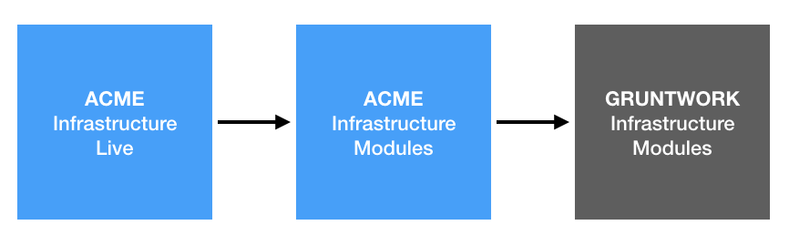

# How the code is organized

Now that you have an idea of [what the architecture looks like](01-architecture-overview.md) and [what's
deployed](02-whats-deployed.md), it's time to look into how the code is organized:

* [Infrastructure code](#infrastructure-code)
* [Sample apps](#sample-apps)

## Infrastructure code

All the infrastructure code is organized into the following repos: 

* **[infrastructure-modules](https://github.com/Veeps-Hosting/infrastructure-modules)**: This repo
  contains all of Veeps Hosting's Terraform modules. Think of each one as an opinionated "blueprint" for how to
  deploy a particular piece of infrastructure. Each module is meant to be reused across multiple environments, so any 
  setting that may differ from environment to environment is exposed as an input variable.
  
* **[infrastructure-live](https://github.com/Veeps-Hosting/infrastructure-live)**: This repo 
  represents the live, deployed state of your AWS account(s). This code "instantiates" the modules in the 
  infrastructure-modules repo in each of your environments (stage, prod, etc), setting the input variables
  for the module with values appropriate for that environment.
 
* **Gruntwork Infrastructure Packages**: Many of the modules in the infrastructure-modules repo, under 
  the hood, use modules maintained by [Gruntwork](http://www.gruntwork.io/). These modules are called *Infrastructure 
  Packages*. You can find the full list of Infrastructure Packages and related tools at: 
  https://github.com/gruntwork-io/toc.
 
Here's an illustration of the relationship between all of these repos:
 

 
 

## Sample apps

To see working example code that you can quickly use with the infrastructure repos above, check out the the following 
"sample apps":

* **[sample-app-frontend](https://github.com/Veeps-Hosting/sample-app-frontend)**: A sample frontend app.
* **[sample-app-backend](https://github.com/Veeps-Hosting/sample-app-backend)**: A sample backend app.
* **[lambda examples](https://github.com/Veeps-Hosting/infrastructure-modules/tree/master/lambda)**: Sample lambda functions.

## Next steps

Now that you know how to find the code, let's talk about how to [Run an App in the Dev 
Environment](04-dev-environment.md).